# SkyDashboard

SkyDashboard aggregates open air-quality, satellite, and weather feeds into a single dashboard that powers proactive alerts. The FastAPI backend unifies TEMPO, OpenAQ, and Open-Meteo data, while the React frontend visualizes local conditions and the alert service pushes SMS notifications through Twilio.

## Live Demo

[http://159.203.5.107](http://159.203.5.107)

## Architecture Overview

## Product Gallery

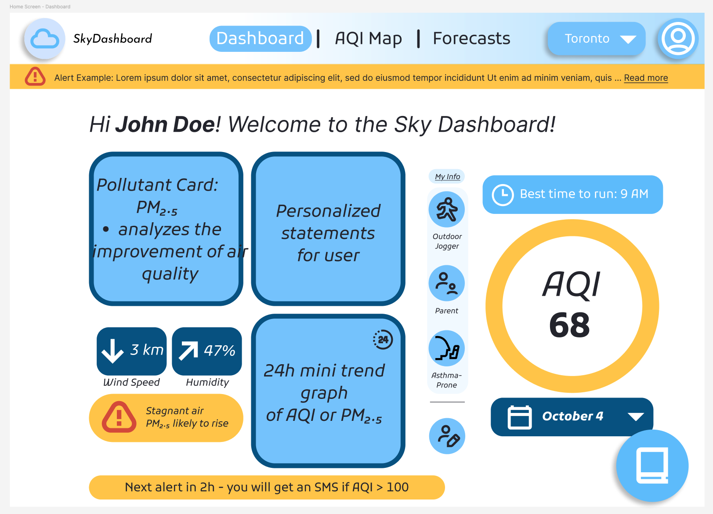
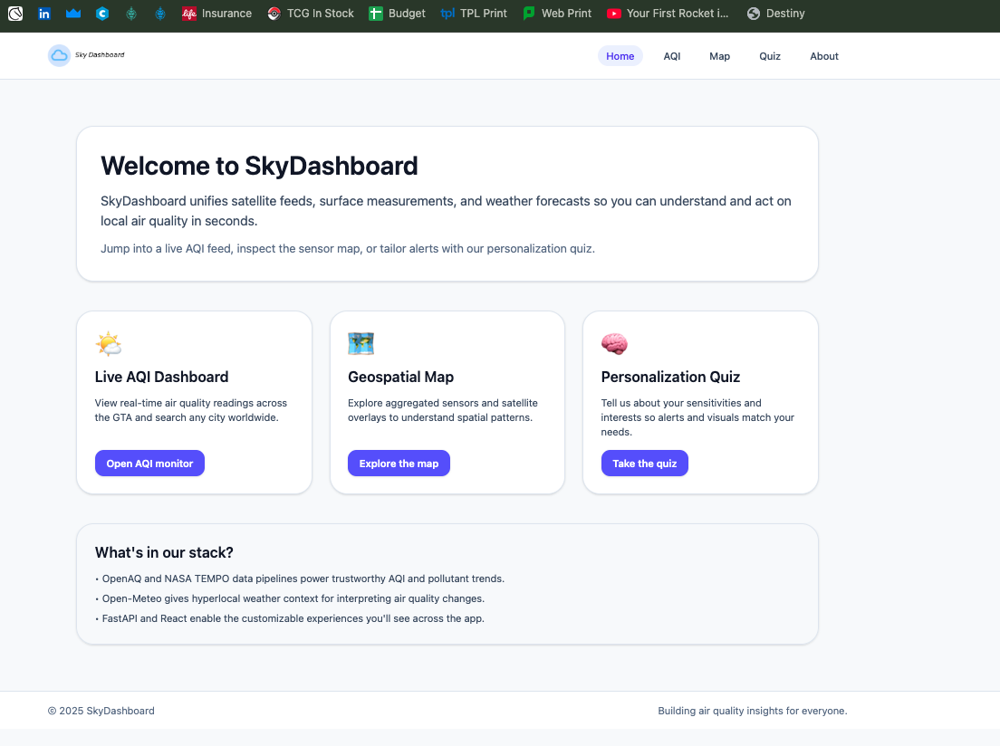
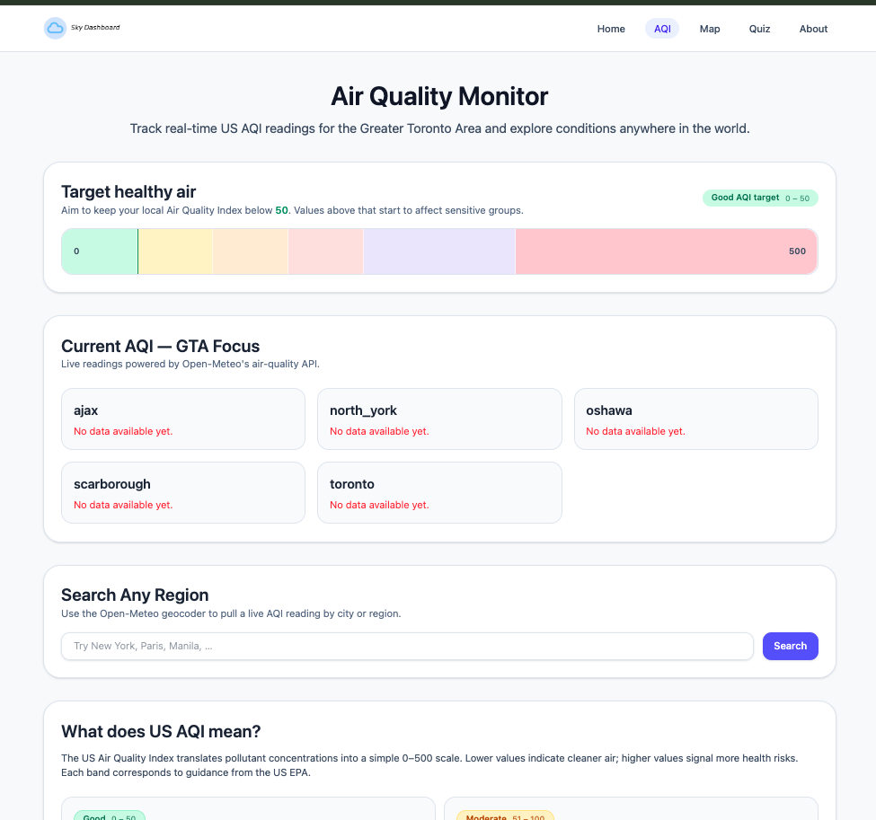
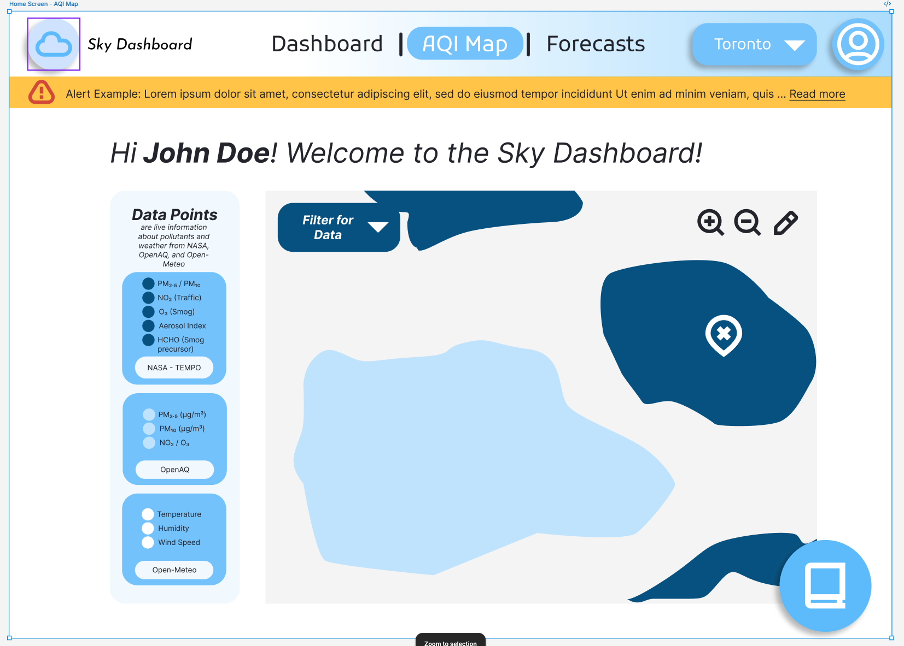
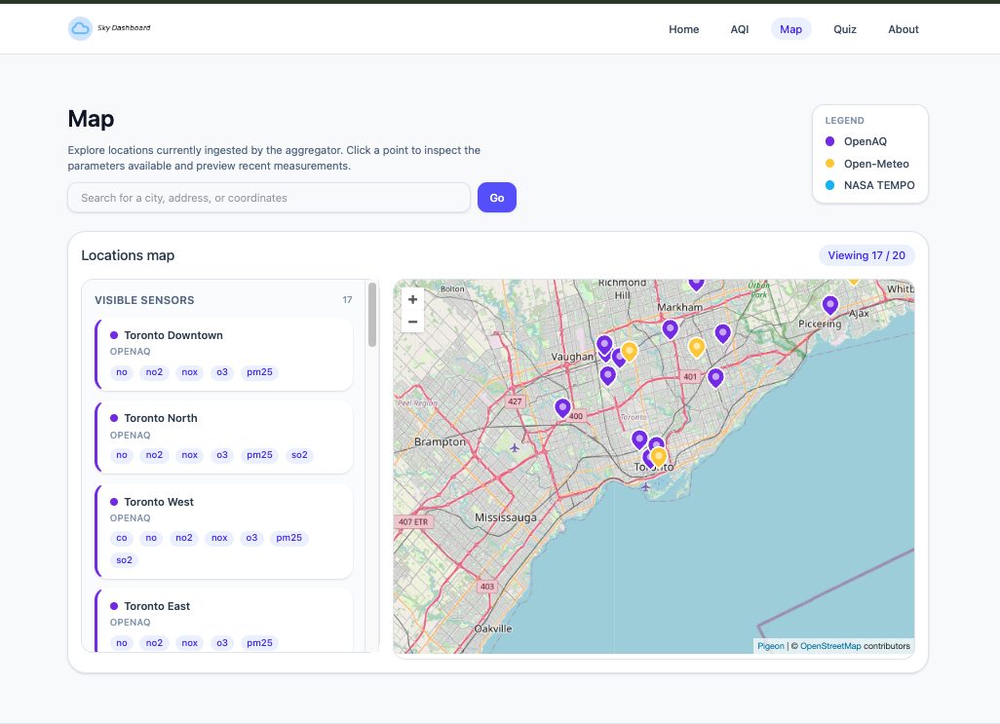
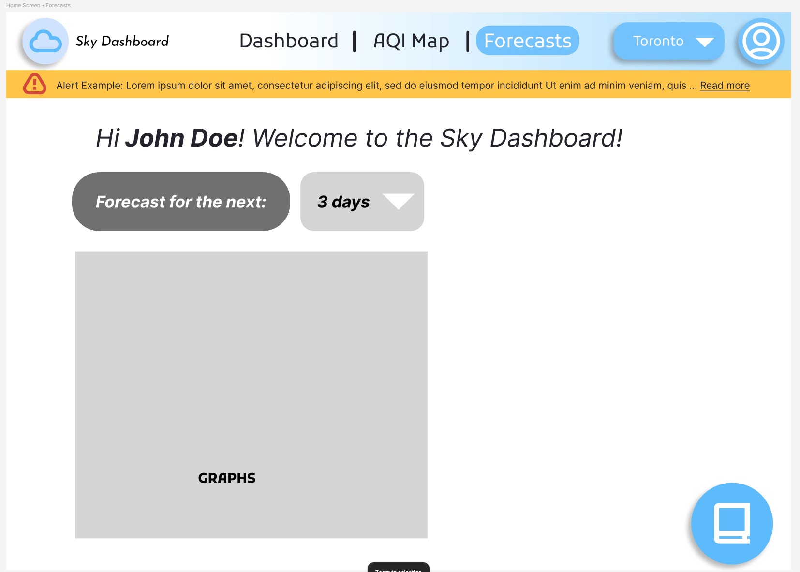
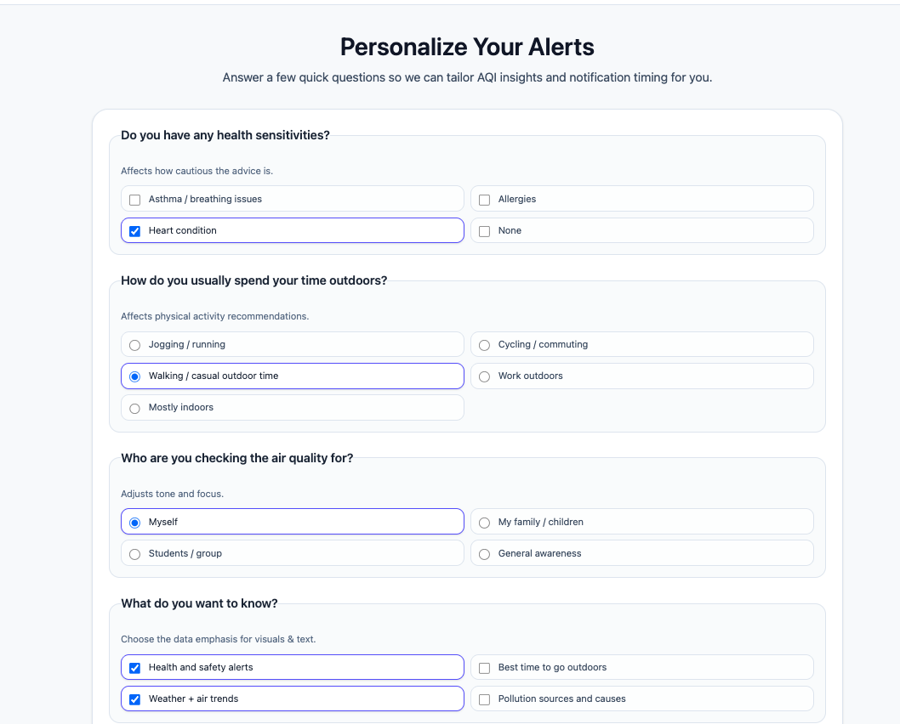
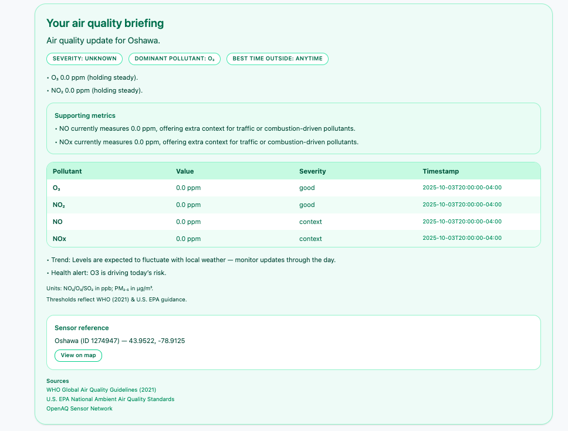
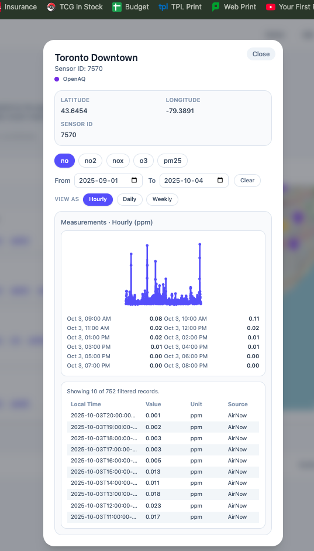
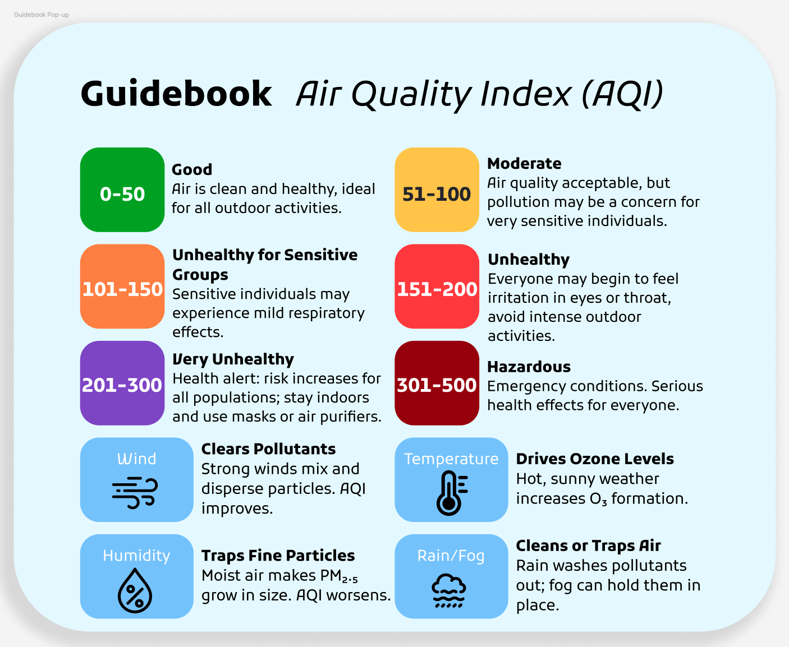
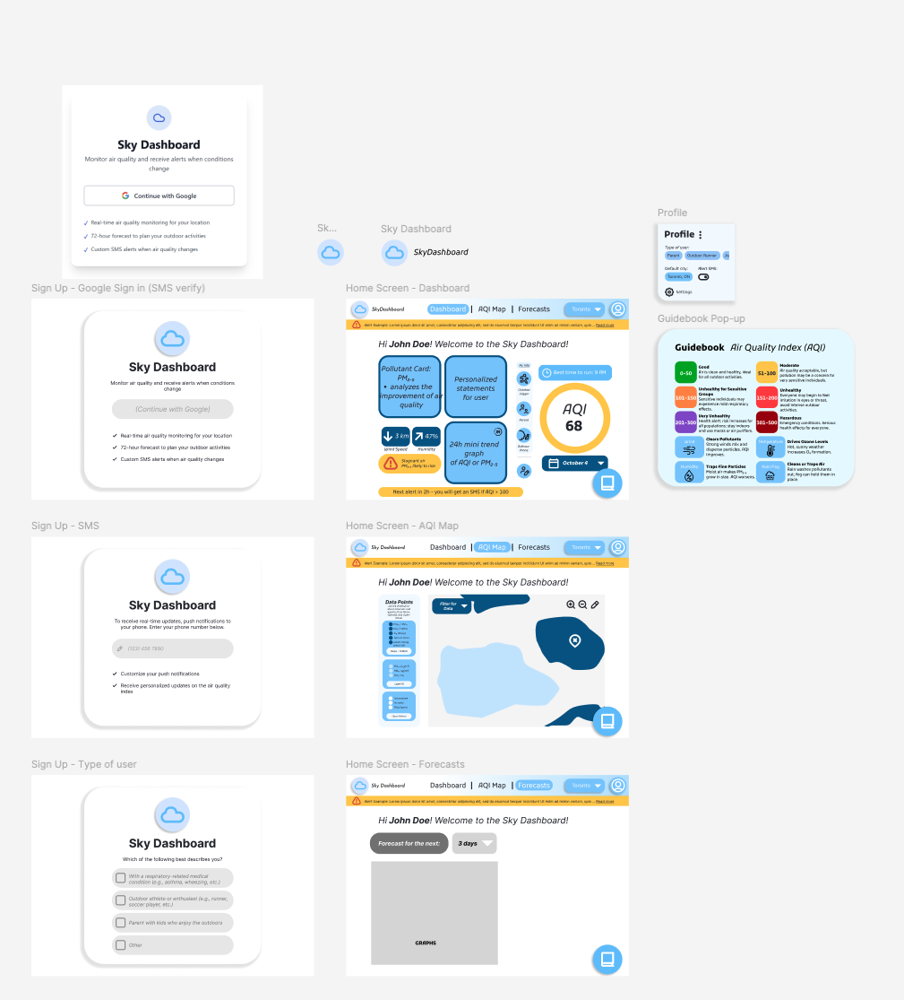
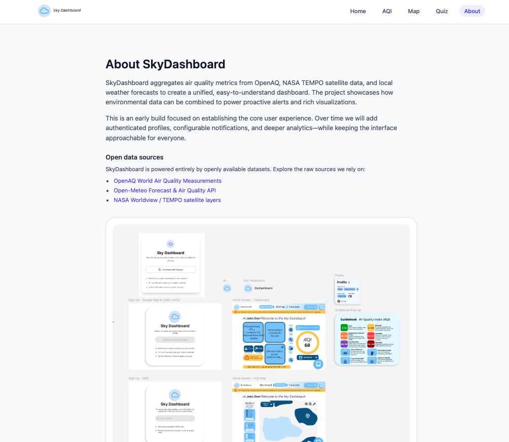

All images are sourced from the `docs/assets` directory to keep the README self-contained.
