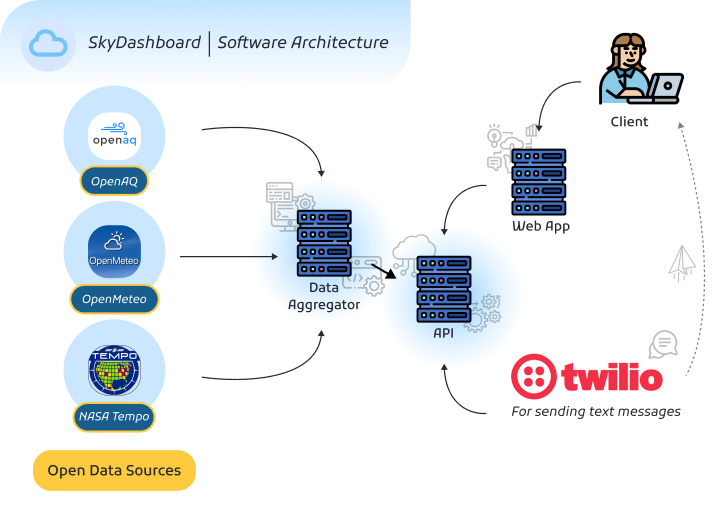

# SkyDashboard

SkyDashboard aggregates open air-quality, satellite, and weather feeds into a single dashboard that powers proactive alerts. The FastAPI backend unifies TEMPO, OpenAQ, and Open-Meteo data, while the React frontend visualizes local conditions and the alert service pushes SMS notifications through Twilio.

## Live Demo

[http://159.203.5.107](http://159.203.5.107)

## Architecture Overview

## The Problem we're trying to solve
There is a lack of personalized air-quality tools for users like runners, outdoor enthusiasts, people with asthma, etc,. We wnat to bridge the gap between NASA data and everyday decisions like ask if the air is clean enough for me to take a walk. Due to the rising urban pollution, there are health concerns that demand clear, real-time guidance like users with asthma. SkyDashboard aims to bridge that gap, and provide users with SMS updates tailored to their location and overall personal situation.

## How we made it
First, we found three sources of data to act as the main driver for our project: OpenAQ, NASA Tempo, and OpenMeteo. OpenAQ has many ground sensors that sense for various air quality data. NASA Tempo data comes from the Tempo satellite and also offers air quality data. OpenMeteo gives general weather data and AQI data given a longitude and latitude. Our goal was to combine these 3 data sources to give insightful tailored advice to the user.  Our data colleting scripts were written in Python.
Once we collected data from these 3 data sources, we stored them locally, then developed a "Data Aggregator" which is an API service to the web app. The Data aggregator will provide sensor data and AQI data to the web app when it requests for it. 
The web app was written in React/Typescript with multiple pages: Home, AQI, Quiz, Map, and About;
- Home Page --> brief intro to the site and what features exist
- AQI --> Air Quality Index lookup page with location search bar
- Quiz --> personalization quiz that gives tailored response on insights on their location and status (asthma, child, etc,.)
- Map --> view raw sensor data on the map to see what kind of data is driving the other features of the site
- About --> learn about the team, software architecture, and see screenshots
All services (web app and apis) are deployed on a virtual private server using nginx. 
There is also an SMS service that sends daily real-time updates tailored to their situation. After completion of the quiz, we store their phone number and personalized answers in to a database, then everyday, we send texts out using Twilio telling them a personal summary of the AQI in their area, and potentially what kind of actions to take.

## Future Improvements
There were some missing features that we would have loved to include if we were given enough time and resources.
The first future improvement is to have a fully functional SMS system. As it works right now, Twilio Free Trial does not allow for un-whitelisted phone numbers to be sent text messages. This means that we cannot send SMS text messages outside of the list of phone numbers that we specify. We would need to create an official business account with actual funds in order to implement this improvement.
The second future improvement is to implement the NASA Tempo data. We unfortunately could not get the nasa tempo to be fully integrated into our ecosystem: the map and to also be considered in the quiz as a datapoint.
The third future improvement is to have an LLM interact with you instead of filling out a quiz. Our team thought it would be a better user experience to talk to a bot instead of a quiz that could ask more tailored questions to your situation.  

## Product Gallery

All images are sourced from the `docs/assets` directory to keep the README self-contained.
